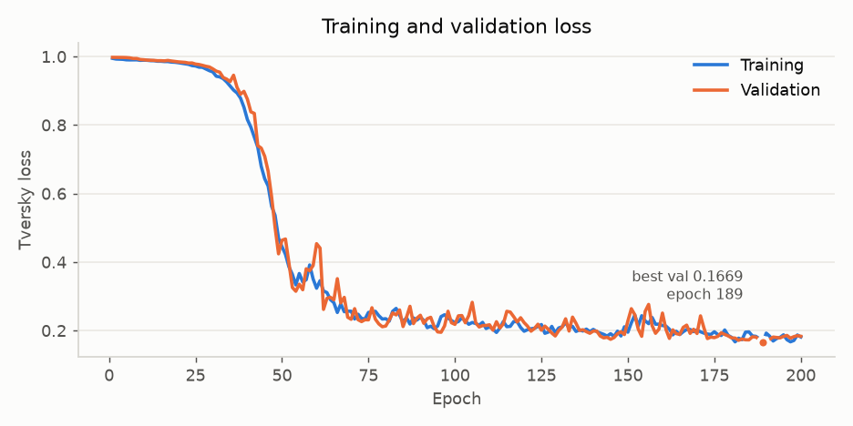
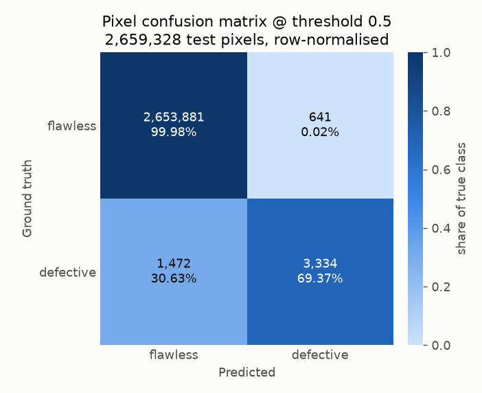
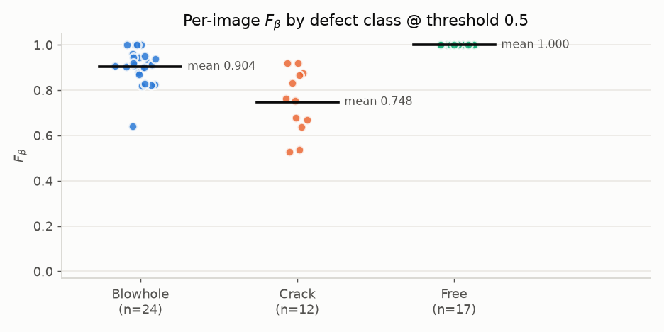
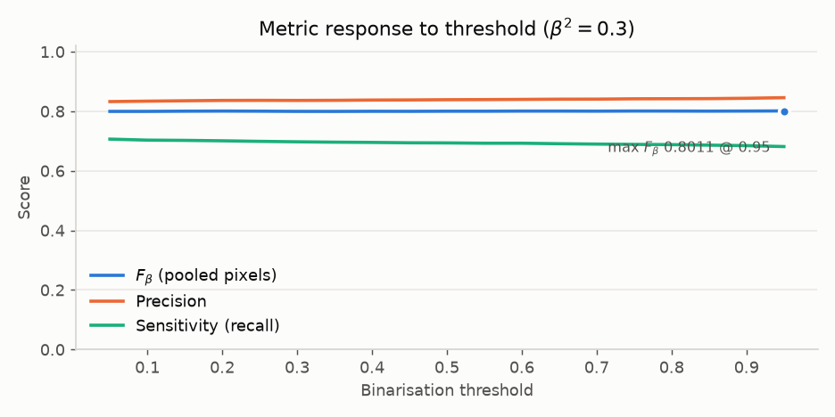
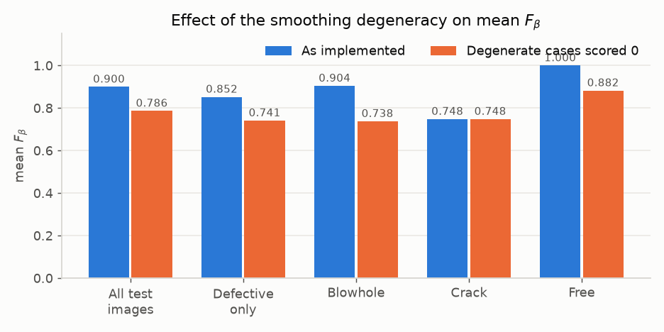
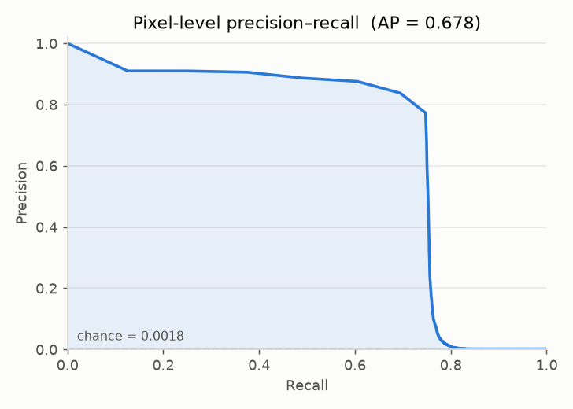
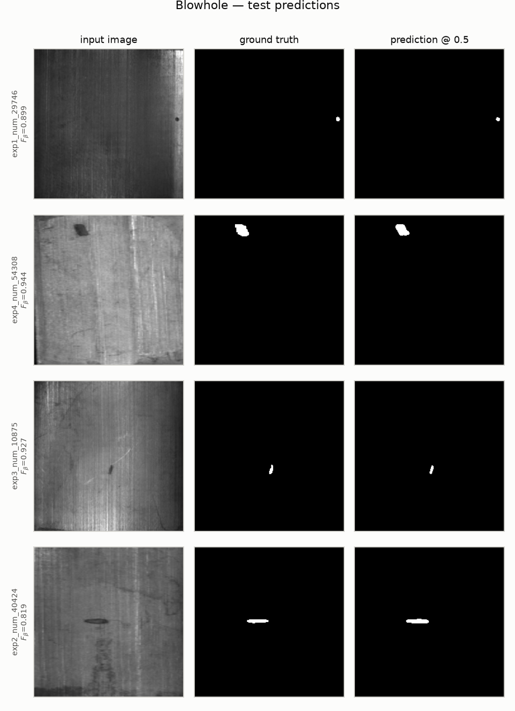
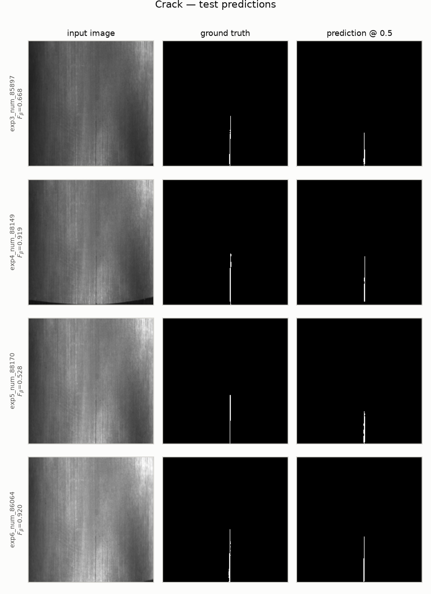
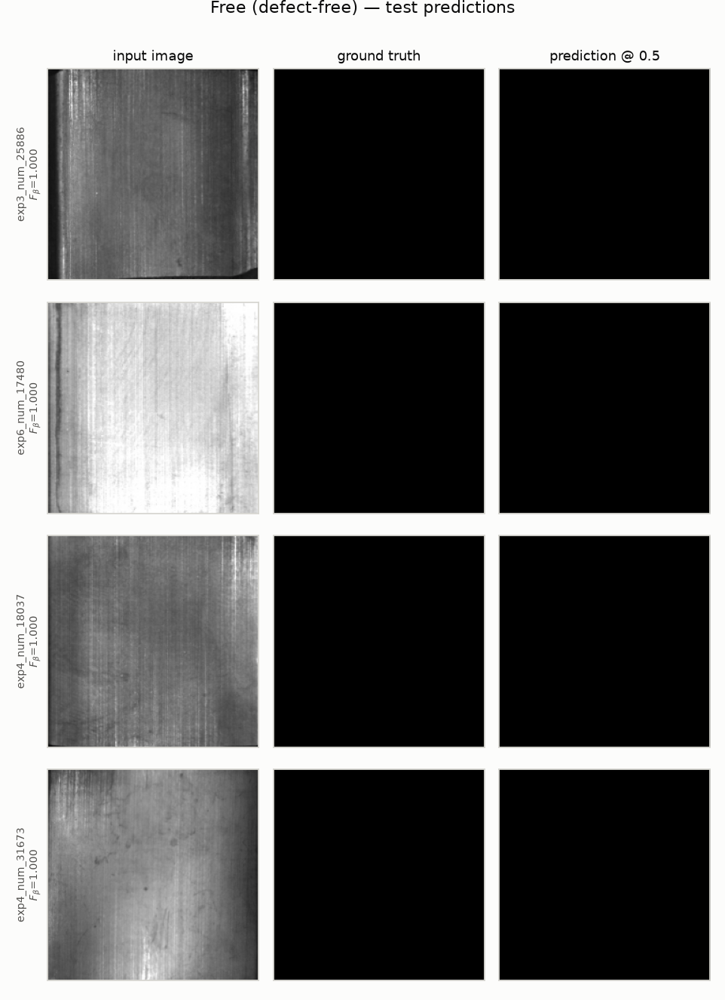

# Results — Surface Defect Detection on Magnetic Tile Images

Binary semantic segmentation of blowhole and crack defects with a 2D U-Net.
Full 200-epoch training run, executed 2026-08-23.

Every number and figure in this document is regenerated by
[`evaluate.py`](evaluate.py) from `model.pt` and `loss_epoch.csv`:

```bash
PYTHONPATH="$PWD" .venv/bin/python evaluate.py
```

---

## 1. Headline

| Metric | Value |
|---|---|
| Best validation loss (Tversky) | **0.1669** at epoch 189 |
| Mean F_beta, per-image, β²=0.3 @ 0.5 | **0.8996** |
| Mean F_beta, per-image, degeneracy corrected | **0.7864** |
| F_beta, pooled pixels @ 0.5 | **0.8001** |
| Max F_beta over thresholds, pooled | **0.8011** @ 0.95 |
| MAE (binary prediction) | **7.946e-04** |
| MAE (probability map) | **7.986e-04** |
| Pixel accuracy | 0.9992 |
| Average precision (pixel PR) | 0.678 |

The README reports **0.931 F_beta / 4.45e-04 MAE**. This run reaches 0.8996 on the
same metric as implemented. See §8 for why the two are not directly comparable and
§7 for why the 0.8996 figure itself is inflated.

---

## 2. Environment

| | |
|---|---|
| Device | Apple Silicon GPU (Metal / `mps`) |
| Python | 3.14.5 |
| torch / torchvision | 2.13.0 / 0.28.0 |
| numpy / pandas | 2.5.2 / 3.0.5 |
| Wall-clock training time | ~20 min (200 epochs, ≈6 s/epoch) |

`requirements.txt` pins `torch==1.7.1+cu101`, which has no wheel for this platform;
current releases were used instead. The original results were produced on Colab
with CUDA, so exact numerical reproduction is not expected.

---

## 3. Dataset and split

Source: [Magnetic-tile-defect-datasets](https://github.com/abin24/Magnetic-tile-defect-datasets).
Classes kept: `Blowhole`, `Crack`, `Free`. The `Free` set is undersampled to 80 images
before splitting. Stratified 70/10/20 split, seed 51.

| Class | Available | Used | Train | Val | Test |
|---|---|---|---|---|---|
| Blowhole | 115 | 115 | 80 | 11 | 24 |
| Crack | 57 | 57 | 39 | 6 | 12 |
| Free | 952 | 80 | 56 | 7 | 17 |
| **Total** | | **252** | **175** | **24** | **53** |

Source image sizes vary (height 222–403 px, width 113–611 px); all pairs are resized
to 224×224. Train pairs get random horizontal flip, vertical flip, and rotation by
one of (0, −90, 90, 180)°.

**Class imbalance at the pixel level** is extreme — measured on the training set:

| | Fraction |
|---|---|
| Defective pixels (positive weight) | 0.002184 |
| Flawless pixels (negative weight) | 0.997816 |

In the test set specifically: **4,806 defective pixels out of 2,659,328** (0.181%).
This is why a 99.92% pixel accuracy is close to meaningless and why F_beta is the
metric of record.

---

## 4. Model

2D U-Net, 4 resolution steps, 32 initial features, dropout 0.2.

| | |
|---|---|
| Input | 1 × 224 × 224 (grayscale) |
| Output | 1 × 224 × 224, sigmoid |
| Encoder features | 32 → 64 → 128 → 256 |
| Bottleneck | 512 |
| Decoder features | 256 → 128 → 64 → 32 |
| Block | Conv3×3 → BatchNorm → SiLU, ×2 |
| **Total parameters** | **10,057,505** (all trainable) |
| Params size | 38.37 MB |
| Forward/backward pass size @ batch 32 | 11,208.75 MB |

---

## 5. Training configuration

| Parameter | Value |
|---|---|
| Epochs | 200 |
| Batch size | 32 (train/val), 1 (test) |
| Optimizer | Adam, lr = 0.002 |
| Loss | Tversky (smooth 1e-10, α = 0.3, β = 0.7) |
| Scheduler | OneCycleLR(max_lr=0.02) — **constructed but never stepped**, see §9 |
| Seed | 51 |
| Checkpoint | lowest validation loss |
| Threshold | 0.5 |

---

## 6. Training results



Loss is flat near 1.0 for ~30 epochs, breaks sharply between epochs 35–55, then
settles into a long noisy plateau. Train and validation track each other closely
throughout — no meaningful overfitting, which is expected given the heavy
augmentation and the small 175-image training set.

| Epoch | Training loss | Validation loss |
|---|---|---|
| 1 | 0.9946 | 0.9976 |
| 10 | 0.9892 | 0.9906 |
| 25 | 0.9724 | 0.9779 |
| 50 | 0.4450 | 0.4636 |
| 75 | 0.2529 | 0.2311 |
| 100 | 0.2227 | 0.2179 |
| 125 | 0.2175 | 0.2009 |
| 150 | 0.1951 | 0.2279 |
| 175 | 0.1964 | 0.1792 |
| 189 | 0.1643 | 0.1669 |
| 200 | 0.1812 | 0.1832 |

Final epoch: train 0.1812 / val 0.1832. Best checkpoint: **epoch 189, val 0.1669**.

---

## 7. Test set results

### 7.1 Pixel confusion matrix



| | Predicted flawless | Predicted defective |
|---|---|---|
| **True flawless** | TN = 2,653,881 (99.98%) | FP = 641 (0.02%) |
| **True defective** | FN = 1,472 (30.63%) | TP = 3,334 (69.37%) |

The model is conservative: it misses about 31% of defect pixels but almost never
fires on clean metal. For a quality-control screen that trade-off is usually the
wrong way round — a missed crack is costlier than a false alarm — so β² = 0.3,
which weights precision above recall, arguably flatters the model here.

### 7.2 Aggregate metrics @ threshold 0.5

Two aggregations are reported because they answer different questions and differ
substantially. **Pooled** treats all test pixels as one population. **Per-image mean**
computes each metric per image, then averages — this is what `inference.py` intends
and what the README's number is based on.

| Metric | Pooled pixels | Per-image mean (all 53) | Per-image mean (36 defective) |
|---|---|---|---|
| Specificity | 0.9998 | 0.9998 | 0.9997 |
| Sensitivity (recall) | 0.6937 | 0.4483 | 0.6601 |
| Precision | 0.8387 | 0.5344 | 0.7867 |
| F1 | 0.7594 | 0.8745 | 0.8152 |
| F2 | 0.7186 | 0.7414 | 0.6748 |
| DSC | 0.7594 | 0.7613 | 0.7041 |
| **F_beta (β²=0.3)** | **0.8001** | **0.8996** | **0.8522** |
| MAE | 7.946e-04 | 7.946e-04 | 1.067e-03 |
| Accuracy | 0.9992 | 0.9992 | 0.9989 |

The per-image F1 (0.8745) exceeding the pooled F1 (0.7594) is the tell that something
is wrong with the per-image aggregation — see §7.5.

### 7.3 Per-class breakdown

| Class | n | specificity | sensitivity | precision | F1_score | F2_score | DSC | F_beta | F_beta_corr | MAE | acc |
|---|---|---|---|---|---|---|---|---|---|---|---|
| Blowhole | 24 | 0.9998 | 0.6948 | 0.7609 | 0.8850 | 0.7027 | 0.7184 | 0.9043 | 0.7377 | 7.00e-04 | 0.9993 |
| Crack | 12 | 0.9996 | 0.5905 | 0.8383 | 0.6755 | 0.6189 | 0.6755 | 0.7480 | 0.7480 | 1.90e-03 | 0.9981 |
| Free | 17 | 0.9998 | 0.0000 | 0.0000 | 1.0000 | 0.8824 | 0.8824 | 1.0000 | 0.8824 | 2.00e-04 | 0.9998 |



Cracks are markedly harder than blowholes (0.748 vs 0.904 as implemented). Cracks are
thin, low-contrast, and often run parallel to the grinding striations in the tile
surface; blowholes are compact high-contrast blobs. Crack MAE is also ~2.7× higher.

### 7.4 Threshold sensitivity



| threshold | precision | sensitivity | F_beta | F_beta_img_mean | F_beta_img_mean_defective | MAE |
|---|---|---|---|---|---|---|
| 0.05 | 0.8325 | 0.7064 | 0.7996 | 0.9007 | 0.8538 | 7.874e-04 |
| 0.10 | 0.8339 | 0.7031 | 0.7996 | 0.9003 | 0.8532 | 7.897e-04 |
| 0.15 | 0.8352 | 0.7022 | 0.8002 | 0.9007 | 0.8538 | 7.885e-04 |
| 0.20 | 0.8364 | 0.7008 | 0.8006 | 0.9007 | 0.8538 | 7.885e-04 |
| 0.25 | 0.8366 | 0.6989 | 0.8002 | 0.9003 | 0.8532 | 7.908e-04 |
| 0.30 | 0.8363 | 0.6975 | 0.7996 | 0.8998 | 0.8524 | 7.934e-04 |
| 0.35 | 0.8367 | 0.6962 | 0.7995 | 0.8997 | 0.8523 | 7.946e-04 |
| 0.40 | 0.8376 | 0.6954 | 0.7998 | 0.8997 | 0.8524 | 7.942e-04 |
| 0.45 | 0.8380 | 0.6941 | 0.7997 | 0.8994 | 0.8519 | 7.953e-04 |
| 0.50 | 0.8387 | 0.6937 | 0.8001 | 0.8996 | 0.8522 | 7.946e-04 |
| 0.55 | 0.8392 | 0.6927 | 0.8001 | 0.8994 | 0.8519 | 7.953e-04 |
| 0.60 | 0.8398 | 0.6927 | 0.8006 | 0.8997 | 0.8523 | 7.942e-04 |
| 0.65 | 0.8405 | 0.6910 | 0.8006 | 0.8995 | 0.8521 | 7.953e-04 |
| 0.70 | 0.8407 | 0.6898 | 0.8003 | 0.8993 | 0.8517 | 7.968e-04 |
| 0.75 | 0.8418 | 0.6887 | 0.8007 | 0.8993 | 0.8517 | 7.964e-04 |
| 0.80 | 0.8421 | 0.6879 | 0.8007 | 0.8992 | 0.8516 | 7.972e-04 |
| 0.85 | 0.8424 | 0.6862 | 0.8004 | 0.8989 | 0.8512 | 7.991e-04 |
| 0.90 | 0.8436 | 0.6846 | 0.8007 | 0.8992 | 0.8516 | 7.995e-04 |
| 0.95 | 0.8456 | 0.6814 | 0.8011 | 0.8990 | 0.8512 | 8.006e-04 |

The curves are essentially flat — F_beta varies only between 0.7995 and 0.8011 across
the entire 0.05–0.95 range. The sigmoid outputs are strongly saturated toward 0 and 1,
so almost no pixels sit in the ambiguous middle. **Max F_beta = 0.8011 @ 0.95** (pooled)
and **0.9007 @ 0.15** (per-image mean). Practically, the choice of 0.5 is not costing
anything, and reporting a "maximum F_beta" over thresholds is not meaningfully different
from reporting it at 0.5 for this model.

### 7.5 Metric validity — the smoothing degeneracy



`metrics.py` adds `smooth = 1e-6` to both numerator and denominator of F_beta, F1 and
DSC. When a prediction is empty *and* the ground truth is not — or vice versa — every
term collapses and the metric returns `smooth / smooth = 1.0`. **A total miss scores a
perfect 1.0.**

Six of 53 test images hit this:

| Image | Class | Defect px | Predicted px | Reported F_beta | Honest F_beta |
|---|---|---|---|---|---|
| exp6_num_346414 | Blowhole | 18 | 0 | 1.0000 | 0.0 |
| exp3_num_853 | Blowhole | 108 | 0 | 1.0000 | 0.0 |
| exp3_num_346347 | Blowhole | 11 | 0 | 1.0000 | 0.0 |
| exp5_num_346381 | Blowhole | 21 | 0 | 1.0000 | 0.0 |
| exp5_num_183254 | Free | 0 | 180 | 1.0000 | 0.0 |
| exp1_num_71177 | Free | 0 | 6 | 1.0000 | 0.0 |

Four blowholes were missed entirely and scored as perfect. Two defect-free tiles were
false-alarmed on and also scored as perfect. Scoring those six honestly (1.0 only when
an empty ground truth meets an empty prediction, 0.0 for a total miss or a pure false
alarm):

| Group | As implemented | Corrected |
|---|---|---|
| All test images | 0.8996 | **0.7864** |
| Defective only | 0.8522 | **0.7411** |
| Blowhole | 0.9043 | **0.7377** |
| Crack | 0.7480 | 0.7480 |
| Free | 1.0000 | **0.8824** |

Blowhole drops the most — it had four of the six degenerate cases. Crack is unaffected;
no crack image was missed outright. **0.7864 is the number to quote for this run.**

Note also that all 17 `Free` images score F_beta = 1.0 as implemented, which lifts the
all-image mean regardless of the degeneracy. Reporting the 36 defective images
separately is the more informative view.

### 7.6 Precision–recall



Average precision **0.678** against a chance baseline of 0.0018 — roughly 375× better
than random on a heavily imbalanced problem. Precision holds above 0.87 out to about
0.6 recall, then collapses vertically past ~0.75 recall: there is a hard ceiling on
recoverable defect pixels that no threshold choice can lift.

The four missed blowholes from §7.5 are part of that ceiling. Their peak sigmoid output
*inside* the ground-truth defect region is 0.0000 (overall image maximum ≤ 0.0001), so
the model is not merely under-confident on them — it produces no signal at all, and
lowering the threshold to 0.05 still yields zero predicted pixels. Those defects are
invisible to this model, not borderline.

### 7.7 Qualitative results







Blowhole masks are recovered with accurate extent and position. Crack masks are found
but consistently under-segmented at the ends — the thin tapering tips fall below
threshold, which is exactly what the 0.59 crack sensitivity reflects. Defect-free tiles
are almost all clean, with the two false-alarm cases noted in §7.5.

---

## 8. Comparison with the README

| | README | This run |
|---|---|---|
| F_beta (β²=0.3) | 0.931 | 0.8996 as implemented / 0.7864 corrected |
| MAE | 4.45e-04 | 7.946e-04 |
| Epochs | 200 | 200 |
| Batch / optimizer / loss | 32 / Adam / Tversky | same |
| Max learning rate | 0.02 (OneCycle) | 0.002 constant (scheduler never steps) |

The gap is explained by some combination of:

1. **A different random split.** Seed 51 is set, but `random.shuffle` ordering depends
   on the glob order and Python version, so the test set is almost certainly not the
   same 53 images.
2. **The learning-rate schedule never runs** (§9). The README credits One Cycle at
   max_lr 0.02; this run effectively trained at a constant 0.002.
3. **Different torch version** (2.13 vs 1.7.1) and backend (Metal vs CUDA).
4. **The custom weight initialisation never runs** (§9).

Items 2 and 4 mean the published result was itself obtained without the two techniques
the README credits — so this run is not reproducing a different configuration so much
as reproducing the same accidental one on different hardware.

---

## 9. Defects found in the codebase

These were left unfixed so the run stayed faithful to the published code. All are
genuine and all affect either training or the reported numbers.

| # | Location | Issue | Impact |
|---|---|---|---|
| 1 | `unet.py:100` | Calls bare `normal_init(...)`; the method is `UNet_2D.normal_init`. The `NameError` is swallowed by `except: pass` on line 101 | Custom Gaussian weight init **never runs**; PyTorch defaults used |
| 2 | `train.py` | `scheduler.step()` is never called; `train_2D` does not accept a scheduler | OneCycleLR **never applied**; LR constant at 0.002 |
| 3 | `metrics.py:53-62` | `smooth` added to both numerator and denominator | Total miss / pure false alarm scores **1.0** (§7.5) |
| 4 | `inference.py:108` | Accumulators divided by `test_cnt` *inside* the batch loop, then further accumulated | `test_metrics.csv` is not a running mean; values are not interpretable |
| 5 | `inference.py:47` | `savefig` outside the loop | Only the final test image is written |
| 6 | `unet.py:137-142` | `dec4` block computed twice, second overwrites first | Wasted compute, no correctness impact |
| 7 | `surfacedefectdetection_magnetictile.py:103,107` | `optimizer_type = 'Adam' """..."""` — implicit string concatenation makes the value `'Adam...'`, not `'Adam'` | Both selectors fall through to the `else` branch; choosing SGD or WeightedBCE by editing the value silently does nothing |

Fixing 1 and 2 is the interesting experiment: the published result was obtained
*without* the weight init and LR schedule the README credits for it.

---

## 10. Generated files

| File | Contents |
|---|---|
| `results/fig1_loss_curves.png` | Train/validation loss vs epoch |
| `results/fig2_confusion_matrix.png` | Pixel confusion matrix @ 0.5 |
| `results/fig3_threshold_sweep.png` | F_beta / precision / recall vs threshold |
| `results/fig4_pr_curve.png` | Pixel-level precision–recall |
| `results/fig5_per_class_fbeta.png` | Per-image F_beta by class |
| `results/fig6_blowhole_predictions.png` | Blowhole qualitative grid |
| `results/fig7_crack_predictions.png` | Crack qualitative grid |
| `results/fig8_free_predictions.png` | Defect-free qualitative grid |
| `results/fig9_metric_degeneracy.png` | As-implemented vs corrected F_beta |
| `results/per_image_metrics.csv` | All 9 metrics × 53 test images |
| `results/per_class_metrics.csv` | Class aggregates |
| `results/threshold_sweep.csv` | 19-point threshold sweep |
| `results/summary.json` | Every scalar in this document |
| `loss_epoch.csv` | Per-epoch loss history |
| `model.pt` | Best checkpoint (epoch 189), 30 MB |

---

## Appendix A — Per-image test metrics

All 53 test images at threshold 0.5. `defect_px` is ground-truth defective pixel count,
`pred_px` is predicted. Rows flagged in the last column hit the smoothing degeneracy
described in §7.5 and their reported `F_beta` of 1.0000 is spurious.

| image | cls | defect_px | pred_px | specificity | sensitivity | precision | F1_score | F2_score | DSC | F_beta | F_beta_corr | MAE | acc | degenerate? |
|---|---|---|---|---|---|---|---|---|---|---|---|---|---|---|
| exp1_num_297464 | Blowhole | 32 | 28 | 1.0000 | 0.8125 | 0.9286 | 0.8667 | 0.8333 | 0.8667 | 0.8989 | 0.8989 | 1.59e-04 | 0.9998 |  |
| exp4_num_54308 | Blowhole | 275 | 248 | 0.9998 | 0.8727 | 0.9677 | 0.9178 | 0.8902 | 0.9178 | 0.9440 | 0.9440 | 8.57e-04 | 0.9991 |  |
| exp3_num_108757 | Blowhole | 55 | 48 | 1.0000 | 0.8364 | 0.9583 | 0.8932 | 0.8582 | 0.8932 | 0.9271 | 0.9271 | 2.19e-04 | 0.9998 |  |
| exp2_num_40424 | Blowhole | 152 | 194 | 0.9991 | 0.9934 | 0.7784 | 0.8728 | 0.9414 | 0.8728 | 0.8193 | 0.8193 | 8.77e-04 | 0.9991 |  |
| exp6_num_346414 | Blowhole | 18 | 0 | 1.0000 | 0.0000 | 0.0000 | 1.0000 | 0.0000 | 0.0000 | 1.0000 | 0.0000 | 3.59e-04 | 0.9996 | **yes** |
| exp1_num_327970 | Blowhole | 37 | 34 | 1.0000 | 0.8919 | 0.9706 | 0.9296 | 0.9066 | 0.9296 | 0.9512 | 0.9512 | 9.96e-05 | 0.9999 |  |
| exp3_num_328014 | Blowhole | 43 | 36 | 0.9999 | 0.7209 | 0.8611 | 0.7848 | 0.7452 | 0.7848 | 0.8241 | 0.8241 | 3.39e-04 | 0.9997 |  |
| exp1_num_4944 | Blowhole | 125 | 133 | 0.9995 | 0.8640 | 0.8120 | 0.8372 | 0.8531 | 0.8372 | 0.8235 | 0.8235 | 8.37e-04 | 0.9992 |  |
| exp5_num_54331 | Blowhole | 255 | 220 | 1.0000 | 0.8588 | 0.9955 | 0.9221 | 0.8831 | 0.9221 | 0.9602 | 0.9602 | 7.37e-04 | 0.9993 |  |
| exp4_num_297524 | Blowhole | 22 | 25 | 0.9999 | 1.0000 | 0.8800 | 0.9362 | 0.9735 | 0.9362 | 0.9051 | 0.9051 | 5.98e-05 | 0.9999 |  |
| exp3_num_54291 | Blowhole | 227 | 224 | 0.9998 | 0.9339 | 0.9464 | 0.9401 | 0.9364 | 0.9401 | 0.9435 | 0.9435 | 5.38e-04 | 0.9995 |  |
| exp3_num_853 | Blowhole | 108 | 0 | 1.0000 | 0.0000 | 0.0000 | 1.0000 | 0.0000 | 0.0000 | 1.0000 | 0.0000 | 2.15e-03 | 0.9978 | **yes** |
| exp3_num_51711 | Blowhole | 102 | 97 | 0.9998 | 0.8725 | 0.9175 | 0.8945 | 0.8812 | 0.8945 | 0.9067 | 0.9067 | 4.19e-04 | 0.9996 |  |
| exp5_num_328057 | Blowhole | 46 | 38 | 0.9999 | 0.7609 | 0.9211 | 0.8333 | 0.7883 | 0.8333 | 0.8784 | 0.8784 | 2.79e-04 | 0.9997 |  |
| exp3_num_346347 | Blowhole | 11 | 0 | 1.0000 | 0.0000 | 0.0000 | 1.0000 | 0.0000 | 0.0000 | 1.0000 | 0.0000 | 2.19e-04 | 0.9998 | **yes** |
| exp6_num_291134 | Blowhole | 172 | 66 | 0.9998 | 0.3372 | 0.8788 | 0.4874 | 0.3846 | 0.4874 | 0.6412 | 0.6412 | 2.43e-03 | 0.9976 |  |
| exp6_num_36280 | Blowhole | 330 | 259 | 0.9998 | 0.7606 | 0.9691 | 0.8523 | 0.7948 | 0.8523 | 0.9115 | 0.9115 | 1.73e-03 | 0.9983 |  |
| exp5_num_346381 | Blowhole | 21 | 0 | 1.0000 | 0.0000 | 0.0000 | 1.0000 | 0.0000 | 0.0000 | 1.0000 | 0.0000 | 4.19e-04 | 0.9996 | **yes** |
| exp2_num_36302 | Blowhole | 214 | 248 | 0.9990 | 0.9299 | 0.8024 | 0.8615 | 0.9013 | 0.8615 | 0.8286 | 0.8286 | 1.28e-03 | 0.9987 |  |
| exp6_num_262705 | Blowhole | 55 | 39 | 1.0000 | 0.7091 | 1.0000 | 0.8298 | 0.7529 | 0.8298 | 0.9135 | 0.9135 | 3.19e-04 | 0.9997 |  |
| exp4_num_51725 | Blowhole | 79 | 93 | 0.9997 | 0.9873 | 0.8387 | 0.9070 | 0.9535 | 0.9070 | 0.8689 | 0.8689 | 3.19e-04 | 0.9997 |  |
| exp4_num_328029 | Blowhole | 42 | 40 | 1.0000 | 0.9048 | 0.9500 | 0.9268 | 0.9135 | 0.9268 | 0.9392 | 0.9392 | 1.20e-04 | 0.9999 |  |
| exp4_num_4779 | Blowhole | 222 | 185 | 0.9999 | 0.8018 | 0.9622 | 0.8747 | 0.8295 | 0.8747 | 0.9197 | 0.9197 | 1.02e-03 | 0.9990 |  |
| exp6_num_308130 | Blowhole | 29 | 26 | 1.0000 | 0.8276 | 0.9231 | 0.8727 | 0.8451 | 0.8727 | 0.8991 | 0.8991 | 1.40e-04 | 0.9999 |  |
| exp3_num_85897 | Crack | 121 | 94 | 0.9995 | 0.5537 | 0.7128 | 0.6233 | 0.5796 | 0.6233 | 0.6685 | 0.6685 | 1.61e-03 | 0.9984 |  |
| exp4_num_88149 | Crack | 166 | 120 | 1.0000 | 0.7229 | 1.0000 | 0.8392 | 0.7653 | 0.8392 | 0.9187 | 0.9187 | 9.17e-04 | 0.9991 |  |
| exp5_num_88170 | Crack | 133 | 130 | 0.9988 | 0.5188 | 0.5308 | 0.5247 | 0.5211 | 0.5247 | 0.5280 | 0.5280 | 2.49e-03 | 0.9975 |  |
| exp6_num_86064 | Crack | 168 | 122 | 1.0000 | 0.7262 | 1.0000 | 0.8414 | 0.7683 | 0.8414 | 0.9200 | 0.9200 | 9.17e-04 | 0.9991 |  |
| exp6_num_265737 | Crack | 179 | 98 | 1.0000 | 0.5419 | 0.9898 | 0.7004 | 0.5958 | 0.7004 | 0.8312 | 0.8312 | 1.65e-03 | 0.9983 |  |
| exp5_num_85642 | Crack | 141 | 149 | 0.9986 | 0.5603 | 0.5302 | 0.5448 | 0.5540 | 0.5448 | 0.5369 | 0.5369 | 2.63e-03 | 0.9974 |  |
| exp2_num_86854 | Crack | 191 | 91 | 0.9999 | 0.4555 | 0.9560 | 0.6170 | 0.5088 | 0.6170 | 0.7626 | 0.7626 | 2.15e-03 | 0.9978 |  |
| exp5_num_116575 | Crack | 115 | 150 | 0.9991 | 0.9304 | 0.7133 | 0.8075 | 0.8770 | 0.8075 | 0.7539 | 0.7539 | 1.02e-03 | 0.9990 |  |
| exp1_num_86828 | Crack | 165 | 71 | 0.9998 | 0.3818 | 0.8873 | 0.5339 | 0.4309 | 0.5339 | 0.6797 | 0.6797 | 2.19e-03 | 0.9978 |  |
| exp6_num_85665 | Crack | 198 | 122 | 1.0000 | 0.6162 | 1.0000 | 0.7625 | 0.6674 | 0.7625 | 0.8743 | 0.8743 | 1.51e-03 | 0.9985 |  |
| exp5_num_32201 | Crack | 349 | 266 | 0.9996 | 0.7077 | 0.9286 | 0.8033 | 0.7431 | 0.8033 | 0.8662 | 0.8662 | 2.41e-03 | 0.9976 |  |
| exp1_num_3191 | Crack | 208 | 95 | 0.9996 | 0.3702 | 0.8105 | 0.5083 | 0.4153 | 0.5083 | 0.6360 | 0.6360 | 2.97e-03 | 0.9970 |  |
| exp3_num_258867 | Free | 0 | 0 | 1.0000 | 0.0000 | 0.0000 | 1.0000 | 1.0000 | 1.0000 | 1.0000 | 1.0000 | 0.00e+00 | 1.0000 |  |
| exp6_num_174804 | Free | 0 | 0 | 1.0000 | 0.0000 | 0.0000 | 1.0000 | 1.0000 | 1.0000 | 1.0000 | 1.0000 | 0.00e+00 | 1.0000 |  |
| exp4_num_180371 | Free | 0 | 0 | 1.0000 | 0.0000 | 0.0000 | 1.0000 | 1.0000 | 1.0000 | 1.0000 | 1.0000 | 0.00e+00 | 1.0000 |  |
| exp4_num_316737 | Free | 0 | 0 | 1.0000 | 0.0000 | 0.0000 | 1.0000 | 1.0000 | 1.0000 | 1.0000 | 1.0000 | 0.00e+00 | 1.0000 |  |
| exp6_num_37675 | Free | 0 | 0 | 1.0000 | 0.0000 | 0.0000 | 1.0000 | 1.0000 | 1.0000 | 1.0000 | 1.0000 | 0.00e+00 | 1.0000 |  |
| exp3_num_269121 | Free | 0 | 0 | 1.0000 | 0.0000 | 0.0000 | 1.0000 | 1.0000 | 1.0000 | 1.0000 | 1.0000 | 0.00e+00 | 1.0000 |  |
| exp3_num_316726 | Free | 0 | 0 | 1.0000 | 0.0000 | 0.0000 | 1.0000 | 1.0000 | 1.0000 | 1.0000 | 1.0000 | 0.00e+00 | 1.0000 |  |
| exp2_num_275393 | Free | 0 | 0 | 1.0000 | 0.0000 | 0.0000 | 1.0000 | 1.0000 | 1.0000 | 1.0000 | 1.0000 | 0.00e+00 | 1.0000 |  |
| exp2_num_306443 | Free | 0 | 0 | 1.0000 | 0.0000 | 0.0000 | 1.0000 | 1.0000 | 1.0000 | 1.0000 | 1.0000 | 0.00e+00 | 1.0000 |  |
| exp2_num_193126 | Free | 0 | 0 | 1.0000 | 0.0000 | 0.0000 | 1.0000 | 1.0000 | 1.0000 | 1.0000 | 1.0000 | 0.00e+00 | 1.0000 |  |
| exp6_num_316778 | Free | 0 | 0 | 1.0000 | 0.0000 | 0.0000 | 1.0000 | 1.0000 | 1.0000 | 1.0000 | 1.0000 | 0.00e+00 | 1.0000 |  |
| exp5_num_183254 | Free | 0 | 180 | 0.9964 | 0.0000 | 0.0000 | 1.0000 | 0.0000 | 0.0000 | 1.0000 | 0.0000 | 3.59e-03 | 0.9964 | **yes** |
| exp1_num_316698 | Free | 0 | 0 | 1.0000 | 0.0000 | 0.0000 | 1.0000 | 1.0000 | 1.0000 | 1.0000 | 1.0000 | 0.00e+00 | 1.0000 |  |
| exp2_num_262233 | Free | 0 | 0 | 1.0000 | 0.0000 | 0.0000 | 1.0000 | 1.0000 | 1.0000 | 1.0000 | 1.0000 | 0.00e+00 | 1.0000 |  |
| exp1_num_118871 | Free | 0 | 0 | 1.0000 | 0.0000 | 0.0000 | 1.0000 | 1.0000 | 1.0000 | 1.0000 | 1.0000 | 0.00e+00 | 1.0000 |  |
| exp4_num_117012 | Free | 0 | 0 | 1.0000 | 0.0000 | 0.0000 | 1.0000 | 1.0000 | 1.0000 | 1.0000 | 1.0000 | 0.00e+00 | 1.0000 |  |
| exp1_num_71177 | Free | 0 | 6 | 0.9999 | 0.0000 | 0.0000 | 1.0000 | 0.0000 | 0.0000 | 1.0000 | 0.0000 | 1.20e-04 | 0.9999 | **yes** |
